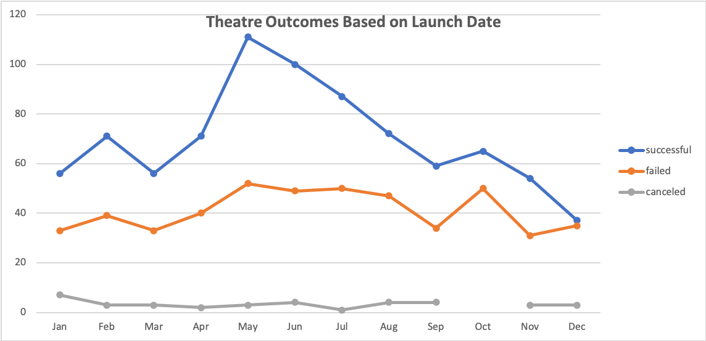
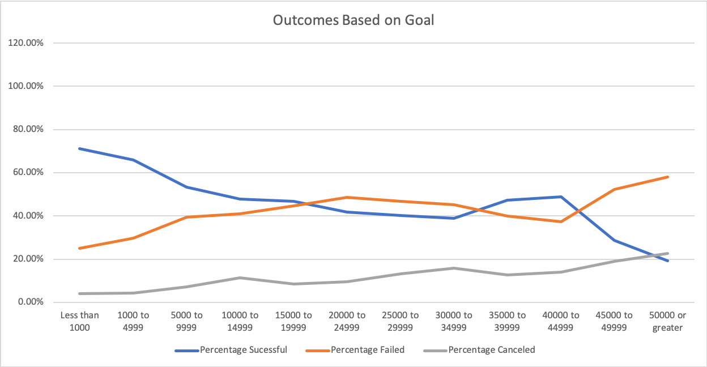

# Kickstarting with Excel
Louise would like to kickstart a theatre project, and has asked us for help with performing some data analyses on previous kickstarter projects. 

## Overview of Project
The following is an overview of the project outlining its purpose.

### Purpose
The purpose of this analysis is to consider past kickstarter project, specifically theatre projects and determine how many were successful and how many failed in relation to their start dates, as well as the goals set. This will help us preditct how Louise's kickstarter might fare. 

## Analysis and Challenges
This section will discuss both analyses, outcomes based on launch date as well as outcomes based on goals. It will also include a discussion of challenges and difficulties encountered during the analyses.

### Analysis of Outcomes Based on Launch Date
This analysis considers past kickstarters in the theatre parent category. It looks at successful, failed, and canceled ones and outlines the number of theatre kickstarter projects in each category that corresponds with each month of the year. An Excel Pivot Table was used to show the data in tabular form, and in order to visualize it a line chart outlining the information from the Pivot Table was created.

### Analysis of Outcomes Based on Goals
This analuysis considers the outcome of kickstarters (Successful, failed or canceled) based on the goals set for each kickstarter. It breaks up the goals into categories starting with all projects that have goals less than $1000, followed by $5000 increment increases until we reach $50,000, and finally a category that is for all projects with goals that are greater than or equal to $50,000. This analysis helps us determine how the projects that had similar budgets to Louise's faired to give us a better idea on what to expect with Louise's project. 

### Challenges and Difficulties Encountered
The following are challenges encountered in the project. 

- Converting the timestamp from Unix to show the date. The data provided us with the start date of each project. This date was in Unix format and required converting to a regular date that Excel can recognize, and that is easier for the reader to understand. In order to do that, a formula had to be written to convert the date, while referencing January 1, 1970; the base date for all Unix time stamps.

- Grouping the Launch Date Data in the Pivot Table. The Excel Pivot Table created showed every single date used for each project; however, we were only interested in the months for each project and not the days or years. In order to obtain this information, we looked at the different groupings of data in the Pivot Table, and we selected grouping by month. 

- Using the CountIfs Function. I was unfamiliar with how to use the CountIfs function to determine the number of successful projects within a given goal range for the kickstarters. I used Excel help in order to learn more about it and be able to use this function to determine the number of projects in each goal bracket for each provided outcome. 

## Results

- The most popular months for theatre kickstarter launch date are May and June, while November and December were the least popular months. The largest number of cancelled projects were in January. 

- Overall, it appears that the lower the goal amount, the higher chance of success; with a 71% success rate for projects with a goal below $1,000 and 20% for projects with a goal greater than $50,000. At $10,000 for Louise's project, we see a success rate of approximately 48%. 

- This data set does not provide more specific locations other than country of origin. The data regarding genre within theatre is also not available.  The analysis does not factor in the location, and also does not factor in successful, failed and canceledproject percentages; which does not give us a great idea what months would lead to higher success rates based on the number of projects attempted.  

- Some other charts and tables that can be created are:
    - Outcome based on geographic location
    - Average donations based on start date
    - Average donations based on goals
